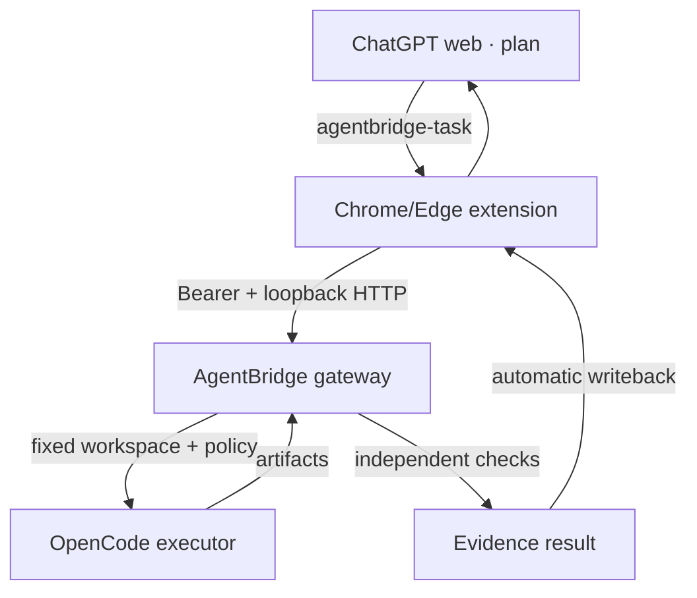

# SZ-AgentBridge

SZ-AgentBridge 0.4 connects an explicitly armed ChatGPT web conversation to a
single Windows-local workspace. ChatGPT acts as the planning and repair brain;
AgentBridge turns its bounded task block into an OpenCode run, independently
checks the declared acceptance conditions, and the browser extension sends the
evidence back into the same conversation. After one-time setup and one **连接
AgentBridge** click, task transfer and result feedback require no copy/paste.



This changes the cost split; it does not make execution free. The web Chat can
do most task decomposition and repair reasoning, while OpenCode still needs a
configured model/provider for the execution it performs.

## Implemented functions

| Function | Current evidence |
| --- | --- |
| ChatGPT web task detection and result insertion | Protocol/adapter unit tests; controlled Chromium gate defined in CI |
| Authenticated browser → local gateway | Real HTTP integration tests with bearer, CORS, loopback and Host-header checks |
| Automatic task → execute → verify → feedback chain | End-to-end fake-executor tests through HTTP and persistent worker |
| OpenCode non-interactive adapter | Real process boundary with version/flag probe, policy injection, timeouts and artifacts |
| Persistent multi-round sessions | SQLite jobs keyed by `session_id + request_id`; idempotency and restart soak |
| Windows execution path | Dedicated Windows GitHub gate for the full suite, bridge soak, packaging and OpenCode CLI probe |

The table describes bounded automated checks. A logged-in, owner-host ChatGPT
conversation is a separate acceptance step because CI has no account session and
cannot prove that a future ChatGPT DOM has not changed.

## Windows quick start

Python 3.12+, Chrome or Edge, Node.js, Git, and OpenCode are required. In
PowerShell:

```powershell
git clone https://github.com/sangziwang91-design/open.git
cd open
py -3.12 -m venv .venv
.\.venv\Scripts\Activate.ps1
python -m pip install -e .
npm install --global opencode-ai
opencode auth login
agentbridge doctor --require-opencode
```

Start the bridge from the `open` directory, but point `--workspace` at the one
repository OpenCode is allowed to change:

```powershell
agentbridge bridge `
  --workspace C:\work\my-project `
  --acknowledge-no-os-sandbox
```

The command creates `.agentbridge\bridge.token`, binds only
`http://127.0.0.1:8765`, and keeps running until Ctrl+C. If `opencode` is not on
`PATH`, add `--opencode-executable C:\full\path\to\opencode.cmd`. Provider keys
from environment variables are not inherited by default; opt in for the OpenCode
process by variable name, for example `--inherit-env OPENAI_API_KEY`. Verification
commands never receive those opt-in provider variables.

Then install the extension once:

1. Open `chrome://extensions` or `edge://extensions` and enable Developer mode.
2. Choose **Load unpacked** and select the repository's `extension` directory.
3. In the extension options, use `http://127.0.0.1:8765` and paste the output of
   `Get-Content .agentbridge\bridge.token`.
4. Open `https://chatgpt.com`, enter a conversation, and click **连接
   AgentBridge** in the lower-right control.
5. After ChatGPT acknowledges the protocol, describe the real task normally.

The extension arms only the current open page. Reloading, manual disconnect, the
configured step limit, or a result requiring human input stops the automatic
loop. The default limit is 10 execution rounds.

OpenCode's [Windows documentation](https://opencode.ai/docs/windows-wsl/)
recommends WSL for its best Windows compatibility.
The direct-Windows path above remains supported and is exercised in Windows CI;
WSL can also be used when Windows localhost forwarding and the target workspace
have been configured by the owner.

## What happens in each round

1. The armed ChatGPT conversation emits one strict `agentbridge-task` JSON block.
2. The extension accepts it only when its session id matches the armed session.
3. The local gateway rejects browser attempts to choose a workspace, executable,
   environment, token, or permissions.
4. A persistent, serial worker compiles the task with operator-owned settings and
   launches OpenCode.
5. AgentBridge captures baseline, command, policy, stdout, stderr, diff, and
   verification evidence.
6. A compact `agentbridge-result` block is automatically sent back to ChatGPT.
7. ChatGPT either closes, asks the user for a blocked decision, or emits a new
   request id for the next repair round.

Repeated `(session_id, request_id)` submissions return the original job. Reusing
the same request id with different content is rejected. On controller restart,
queued jobs resume, but an unknown in-flight process is marked
`RECOVERY_REQUIRED` and is never blindly replayed.

## Security boundary

- The gateway listens on a loopback address only, requires a random bearer token,
  accepts Chrome-extension origins rather than web-page origins, rejects DNS
  rebinding Host headers, bounds bodies and queue depth, and runs one job at a
  time per workspace.
- The token is kept in extension-local storage, not synchronized storage, and is
  used by the service worker rather than inserted into the ChatGPT page.
- Chat cannot select the filesystem root or elevate local permissions. Those are
  fixed at gateway startup.
- OpenCode receives a minimal environment allowlist, external-directory and
  subagent denials, `.env` protection, plugin isolation, bounded timeouts, and
  process-tree cleanup.

AgentBridge is not an operating-system sandbox. The bridge requires
`--acknowledge-no-os-sandbox` because OpenCode and task-declared verification
commands can execute local code. The OpenCode adapter deliberately allows edit,
shell, network and delete effects; shell commands can escape tool-level path rules.
Treat the armed conversation as trusted controller input and use a disposable or
version-controlled workspace with recoverable credentials and backups.

## Supported and unsupported surfaces

The shipped adapter supports the ChatGPT website in Chrome/Edge. It does not
claim support for the native ChatGPT app, arbitrary closed native apps, Claude,
Gemini, Kimi, or future ChatGPT DOM revisions. Additional websites need their own
tested DOM adapter; a generic clipboard robot is intentionally not presented as
reliable automation.

## Local evidence commands

```bash
python -m pip install -e '.[dev]'
python -m pytest
ruff check src tests scripts
mypy src
bandit -q -r src
npm ci
npm test
python scripts/package_extension.py
python scripts/bridge_soak.py --cycles 100 --restart-every 20
python scripts/opencode_adapter_soak.py --cycles 100
python -m build
```

The Chromium test is `npm run test:browser`; it needs a Playwright Chromium
installation and a display/Xvfb. Exact bounded results and remaining limits are
recorded in `VALIDATION.md` and `validation/`.

## Existing control-plane CLI

The lower-level evidence-gated commands remain available: `init`, `doctor`,
`submit`, `status`, `run`, `verify`, `feedback`, and `recover`. For a deterministic
local smoke test without OpenCode:

```bash
agentbridge submit examples/task-success.yaml --db demo.db
agentbridge run TASK-DEMO-SUCCESS --executor fake --db demo.db --runs-dir data/runs
agentbridge verify TASK-DEMO-SUCCESS --db demo.db --runs-dir data/runs
agentbridge feedback TASK-DEMO-SUCCESS --db demo.db
```

SZ-AgentBridge is independent software and is not built by or affiliated with
OpenAI, ChatGPT, or the OpenCode team.
